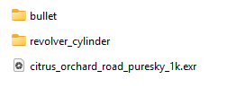

# First Bake - Bullet

Now let's get straight to it. For the purpose of the first example, I will demonstrate the workflow in both Maya and Blender. Following examples will be done in only one of the DCC applications, but the workflow still applies to all supported software.

## In General

If you haven't already, please unpack the Examples.zip (you will find it on the downloads page of the addon).

After unzipping you should see contents similar to this (this may be subject to change, if I add more examples in the future):

<figure><figcaption></figcaption></figure>

For this example we will concentrate on the "bullet" folder. You will find these files in there :

* bullet.fbx
* bullet\_ao.png
* bullet\_normal.png


The FBX file is already set up with the links to the textures. If you are working on your custom model, you have to create materials and texture links manually.

