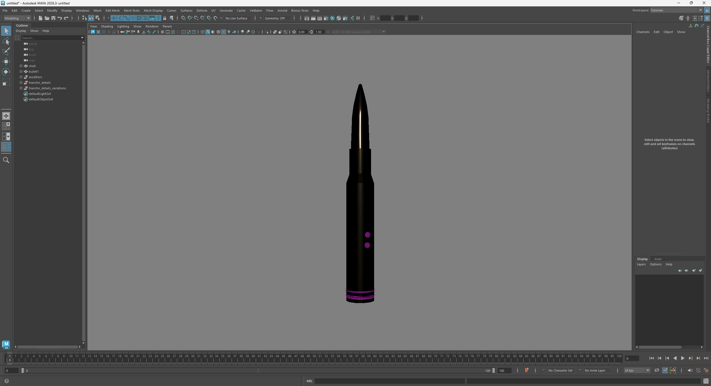
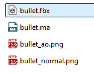
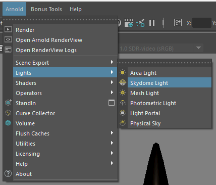
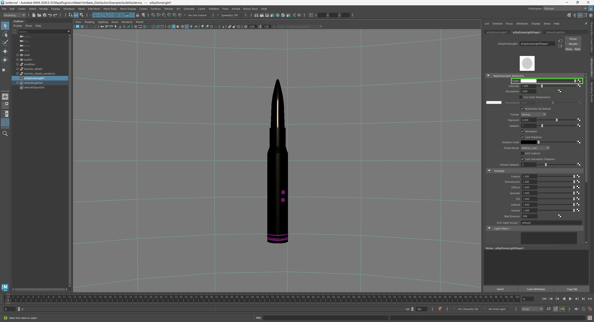
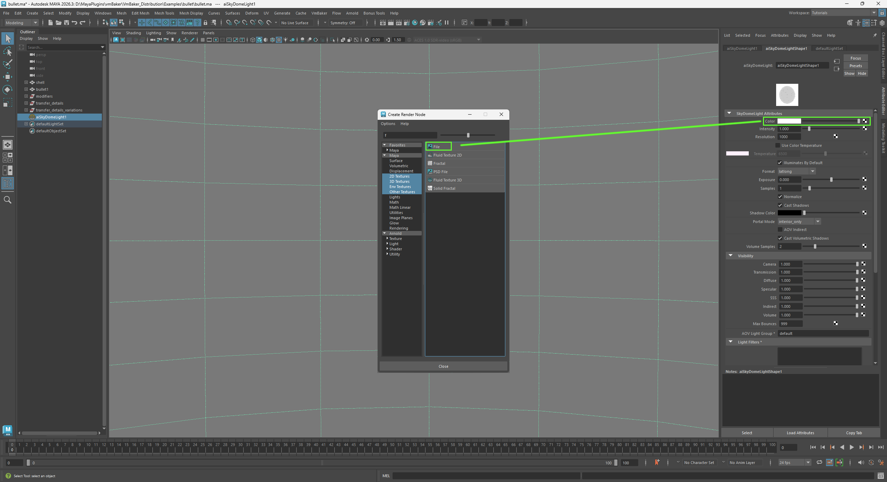
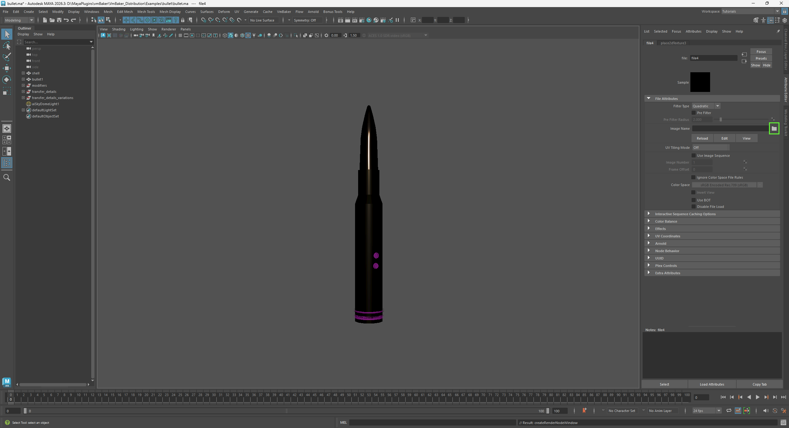
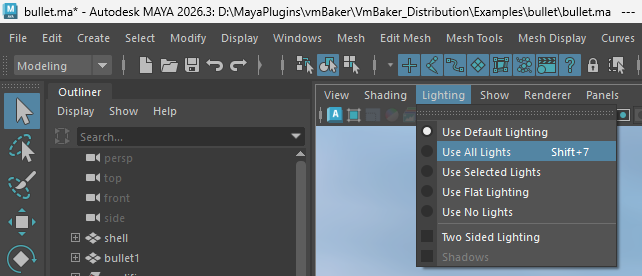
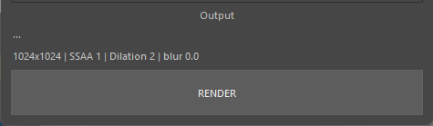
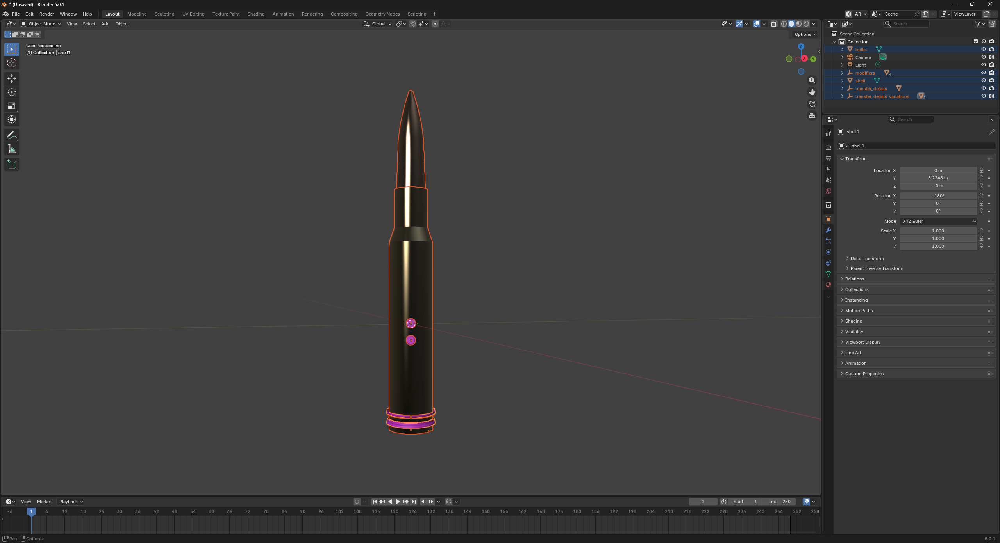
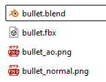

# Initial scene setup

#### Initial scene setup



First, let's open a fresh, empty scene. Import the **bullet.fbx** file using File -> Import and locate the unzipped **bullet.fbx**.

After importing, you should see something similar to this.

<figure><figcaption></figcaption></figure>

Now please save the scene in the same directory as the FBX file. So your directory should look similar to this.

<figure><figcaption></figcaption></figure>

This is for convenience so that VmBaker can automatically guess the output paths for rendering.

This is an optional step to get a better preview of the model. It will load the HDRI and use it as cubemap reflections in the viewport.

1. Please add a sky dome light using Arnold -> Lights -> Skydome Light
2. In the attributes editor of the newly created aiSkyDomeLight1 please assign some HDRI image to the Color slot as shown in the screenshots.
   1. You may find free HDRI here [https://polyhaven.com/](https://polyhaven.com/)
3. Enable all lights in the viewport settings.
4. If you wish, disable the preview of the HDRI in the background by disabling **Show -> Viewport -> Lighting, Shading & Rendering -> Lights.** I will keep it disabled.

<figure><figcaption></figcaption></figure> <figure><figcaption></figcaption></figure> <figure><figcaption></figcaption></figure> <figure><figcaption></figcaption></figure> <figure><figcaption></figcaption></figure> <figure><figcaption></figcaption></figure>

Now have a look at the outliner's content. Specifically, the "modifiers", "transfer\_details", and "transfer\_details\_variations" groups. All of these are provided to demonstrate the baking process.

For now you may hide these, if they distract you. We'll unhide them one by one once we will be baking them into the texture.

Open the VmBaker window from the main menu using **VmBaker -> Open VmBaker** and you should see the interface, with the texture output paths already filled in.



Create a new scene and remove the default cube.

Import the example file using **File -> Import -> FBX** and load the **bullet.fbx** file.

<figure><figcaption>
After import in Blender
</figcaption></figure>

Change the renderer to Cycles -> GPU Compute and switch to **Viewport shading**.

<figure><figcaption>
Viewport shading on
</figcaption></figure>

There are some groups like **modifiers**, **transfer\_details**, and **transfer\_details\_variations**—you may hide these or use Local View so they don't get in the way.

Now, please save the scene in the same directory as the FBX file so your directory looks similar to this.

<figure><figcaption></figcaption></figure>

If the add-on is activated properly, you should see a new panel called **VmBaker** in the Blender N-Panel (sidebar). Please open it.


