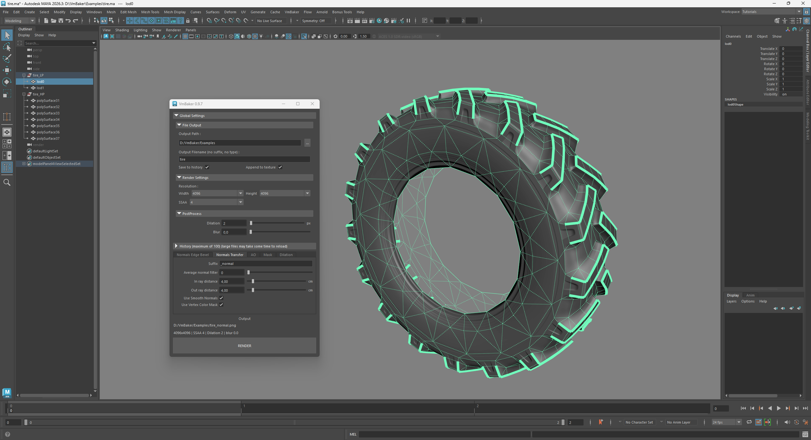
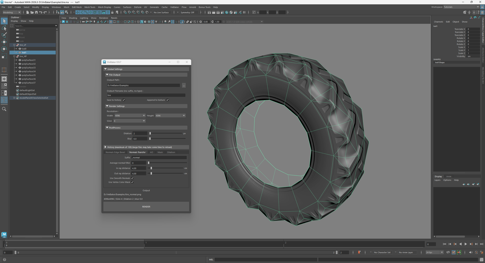
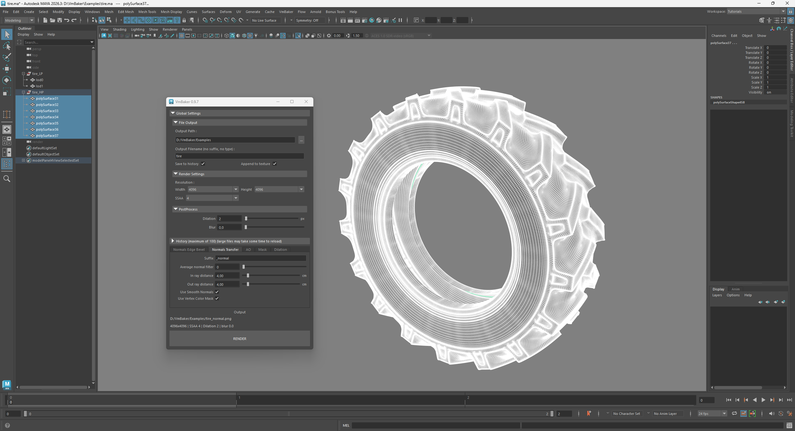
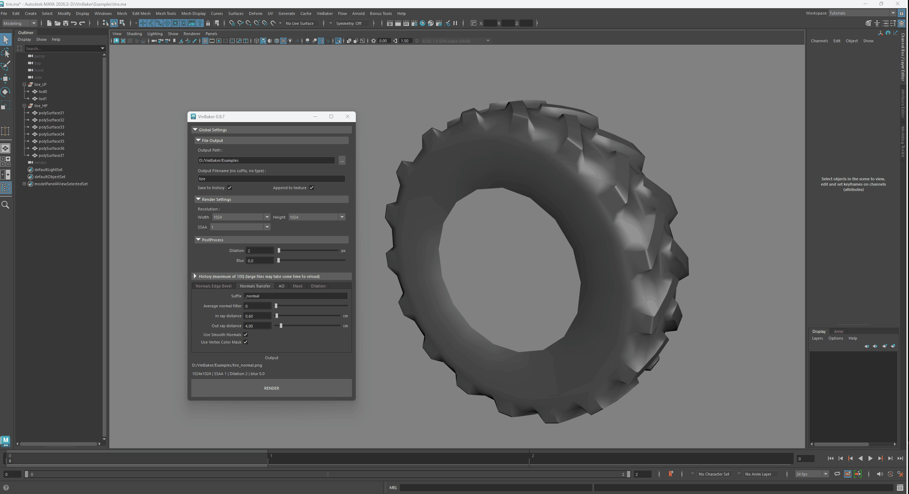
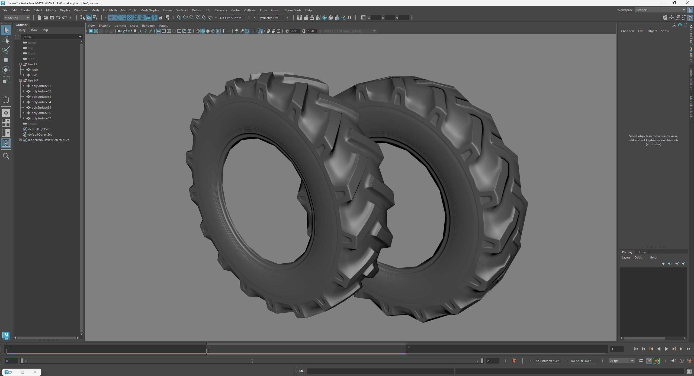
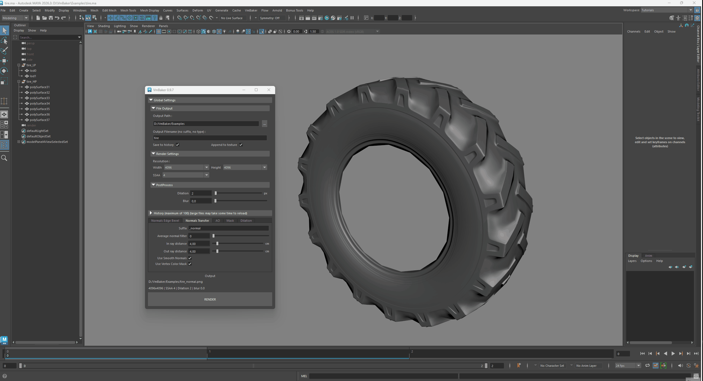
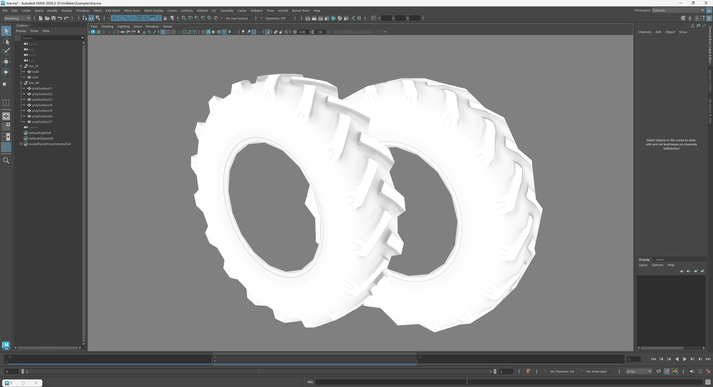

# Highpoly to Lowpoly transfer Normal+AO

This example consists of two groups - lowpoly model group and highpoly model group. Both groups have multiple objects inside.

I will showcase this on a model of a vehicle tire.

<figure><figcaption>
lowpoly LOD0 example
</figcaption></figure> <figure><figcaption>
lowpoly LOD1 example
</figcaption></figure> <figure><figcaption>
highpoly model example
</figcaption></figure>

Because we want to use ordinary details transfer from highpoly to lowpoly - we will use the Normals Transfer tab and later on the AO tab.

## Baking Normal




<figure><figcaption>
Normal transfer bake setup
</figcaption></figure> <figure><figcaption>
example of LOD0 and LOD1 with baked normalmap
</figcaption></figure>




Notice that you can bake one group of objects into another group of objects. Of course you may select individual objects if you wish.

For transfer the selection works like this :

1. select the source - highpoly model
2. select the target - lowpoly model
3. use Normals Transfer tab (or enable Transfer in other tabs)
4. bake

Second image shows both LOD0 and LOD1 models baked from the same highpoly source.




I'm using Isolate selection to show only the lowpoly model of the tire - this is just so that it's visible what is baked.


## Baking AO




<figure><figcaption>
AO transfer bake setup
</figcaption></figure> <figure><figcaption>
example of LOD0 and LOD1 with baked AO
</figcaption></figure>




The process with AO is similar.

Select first the source, then target, enable Transfer and hit bake.

The end of the animation is just me showing the preview of the texture.




I'm skipping the materials setup in this example and concentrating on the baking only.

The VmBaker only renders the textures, you have to link it to your materials yourself.

Keep in mind that you can bake into textures without the materials.

