# Lowpoly revolver cylinder

Now let's try to bake details onto a very low-poly model—literally just a simple cylinder—so that it resembles a revolver cylinder.

This example is to showcase some non-ordinary features of VmBaker - such as baking "fake" booleans using the Edge Bevel with Transfer options.

Please find the **revolver\_cylinder** folder inside the examples.


I will not cover the basic scene setup here, you may find it in the [first-bake.md](first-bake/first-bake.md "mention") of the [first-bake](first-bake/ "mention")example.



In this example, I will use Blender for the showcase, but the logic remains the same inside any other supported DCC.


## Baking



### FBX Scene contents

As in the [first-bake](first-bake/ "mention") example, you will find groups called **modifiers**, **transfer\_hard\_normals**, **transfer\_smooth\_normals**.

These are provided to make it straightforward to follow the baking steps. Please feel free to try your own models or modify the example ones.

I like to keep these objects semi-transparent so that I can see the bake beneath.



### Baking the base

Start off by selecting the **revolver\_cylinder** mesh and baking it using the settings in the screenshot - or try anything you like the most.

A radius of 0.1cm works well for this example.

<figure>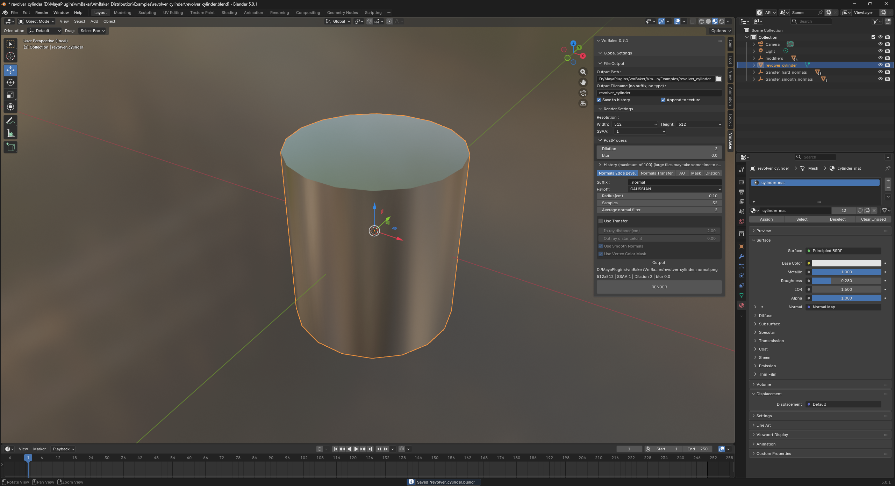<figcaption></figcaption></figure> <figure>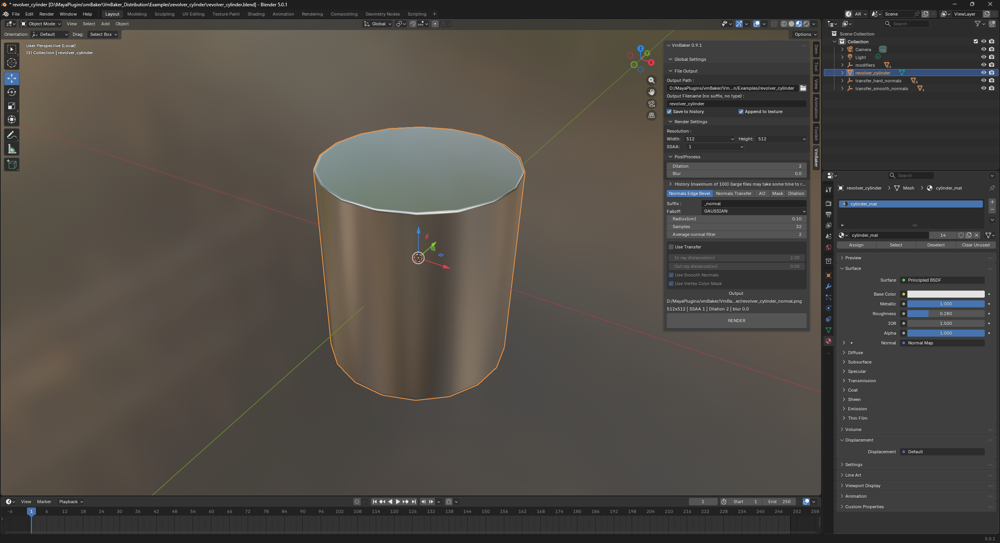<figcaption></figcaption></figure>

Now try to include the **modifiers** group, and have a look what it does.&#x20;

<figure>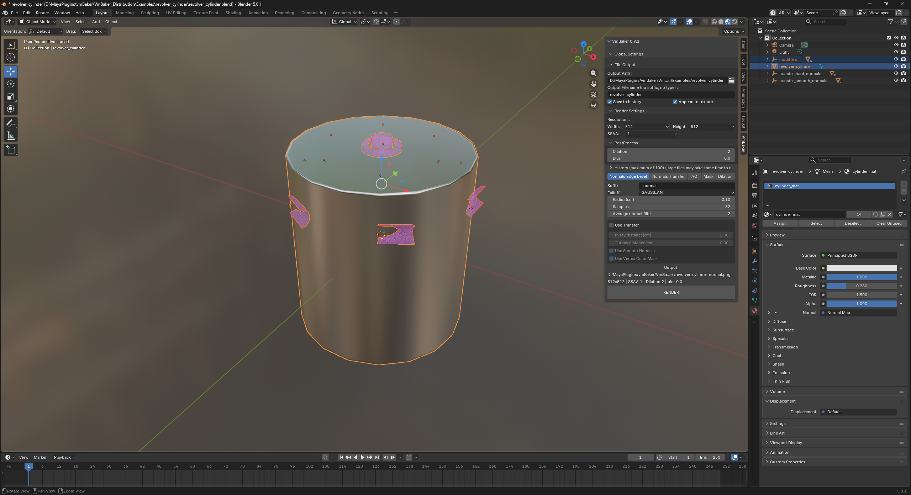<figcaption></figcaption></figure> <figure>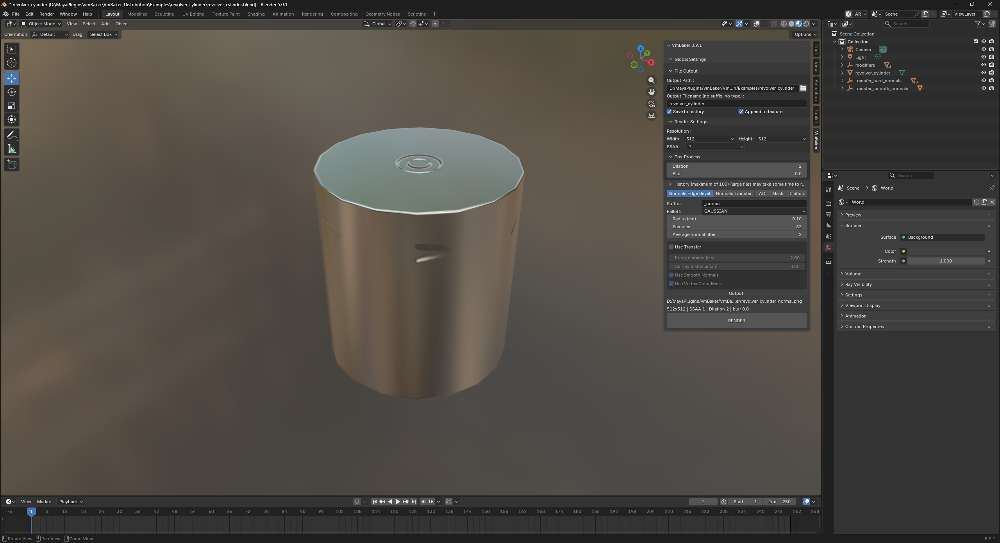<figcaption></figcaption></figure>


You may select just the root of the selection that you want to be used for baking. When the root is selected it automatically includes all the children inside that group.




### Adding additional details

Start off by baking the group **transfer\_hard\_normals**.

The settings are simple: use **Transfer** and make sure **Smooth Normals** is disabled, as shown in the screenshots.


Keep in mind that when using **Transfer** the order of selection matters. Always select the target object last.


<figure>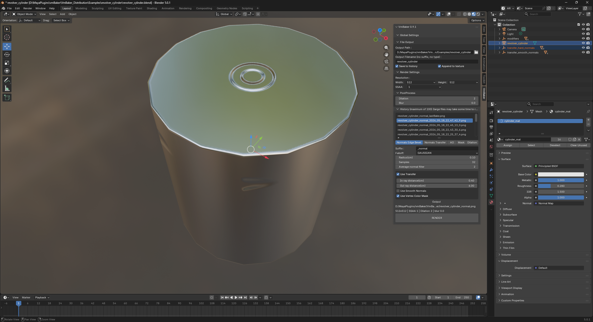<figcaption></figcaption></figure> <figure>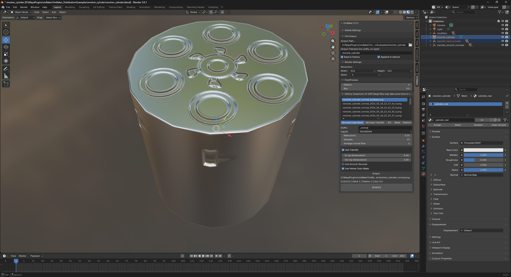<figcaption></figcaption></figure> <figure>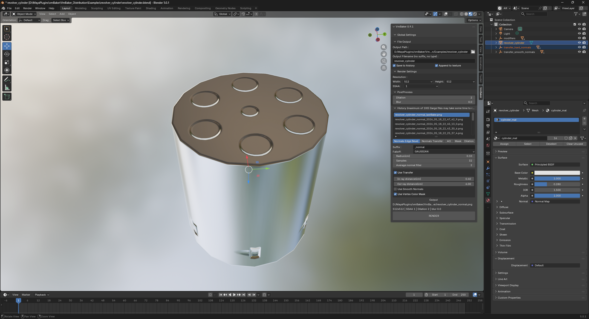<figcaption></figcaption></figure>

Now include the group **transfer\_smooth\_normals** - again follow the settings in the screenshots. This time change the **Radius** to 0,3 and **In ray distance** to 2 and **Out ray distance** to 0.

<figure>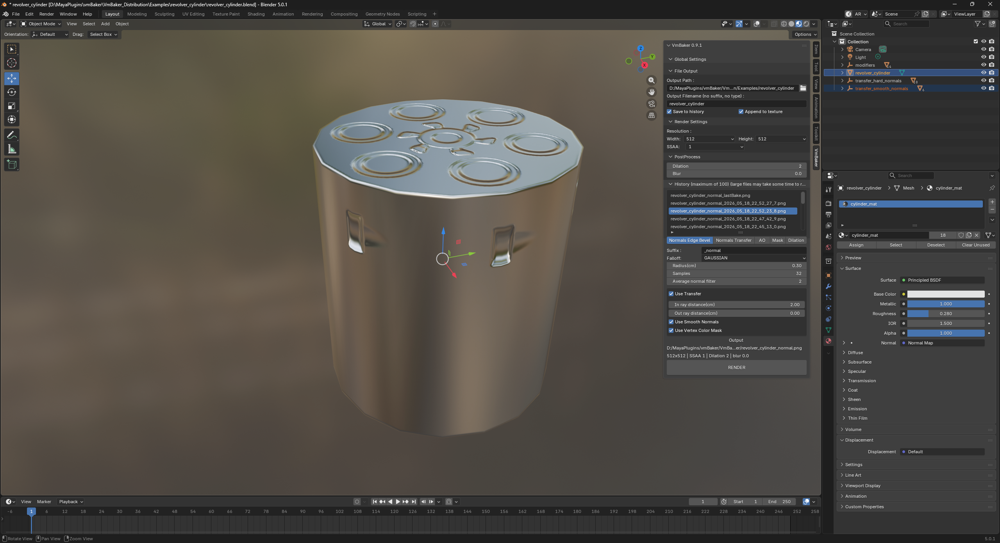<figcaption></figcaption></figure> <figure>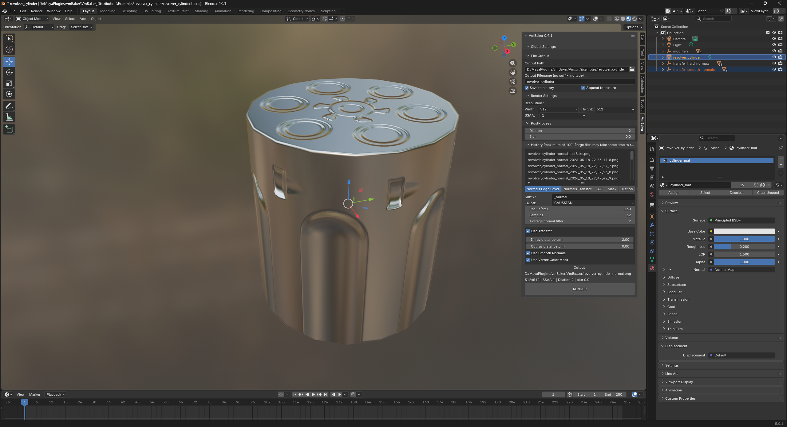<figcaption></figcaption></figure>

Perhaps experiment with the radius settings.


As this type of baking is overlaying the bakes on top of each other, use **History** to get back if you do not like the current bake.


<figure>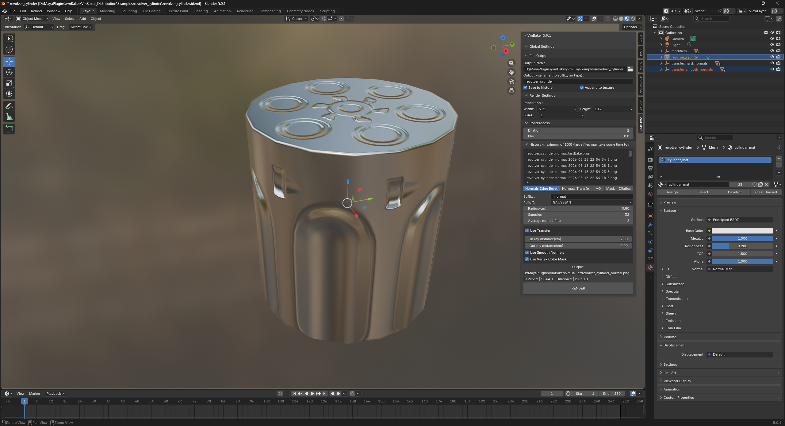<figcaption></figcaption></figure> <figure>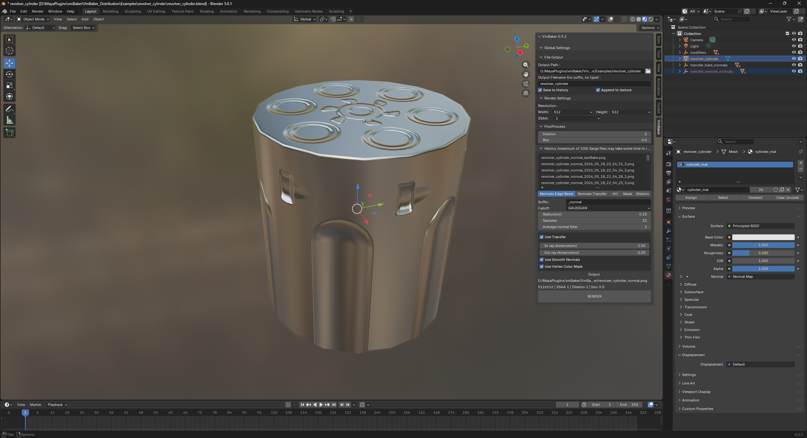<figcaption></figcaption></figure>

Inspect the objects inside that group—move them and try baking them individually to gain intuition for the In / Out ray distances.

Or try using completely different objects.



### Conclusion

But in the end, you should have something similar to this.

<figure>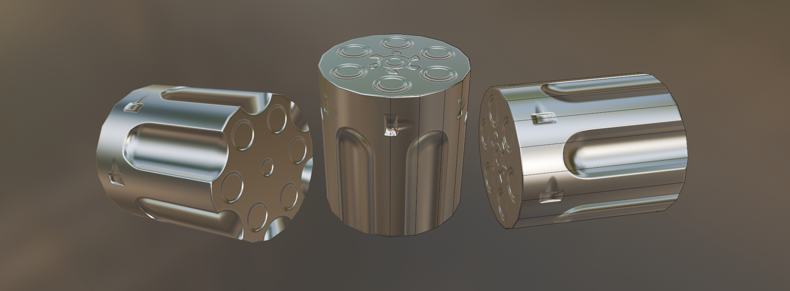<figcaption></figcaption></figure>



