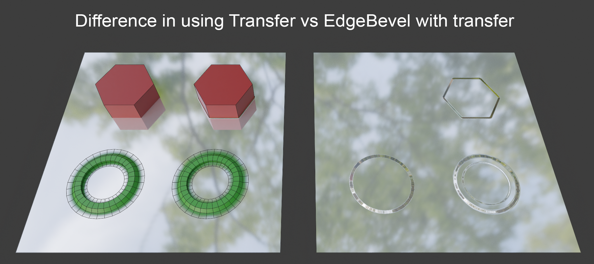
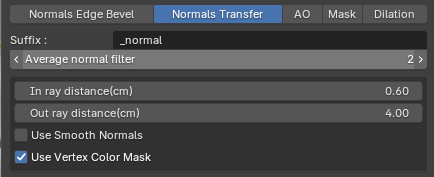
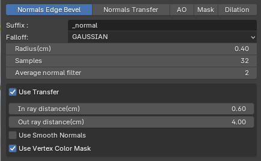
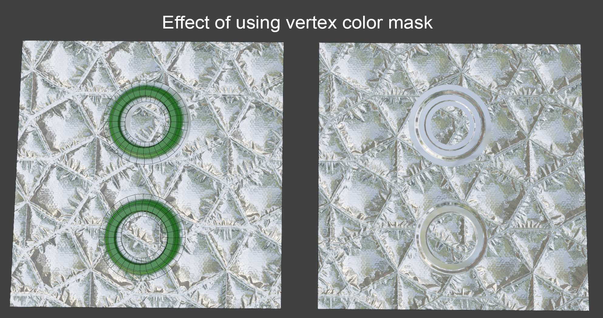
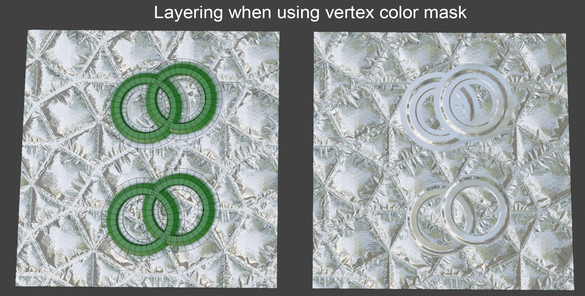
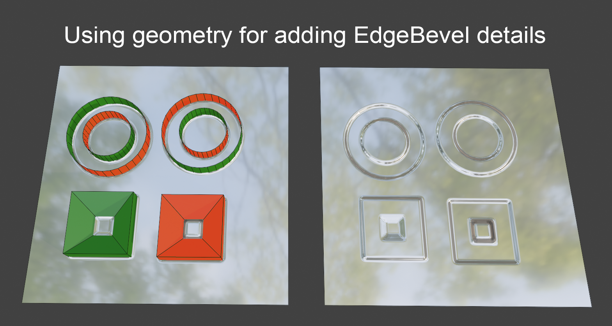
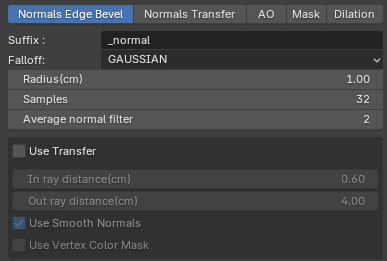
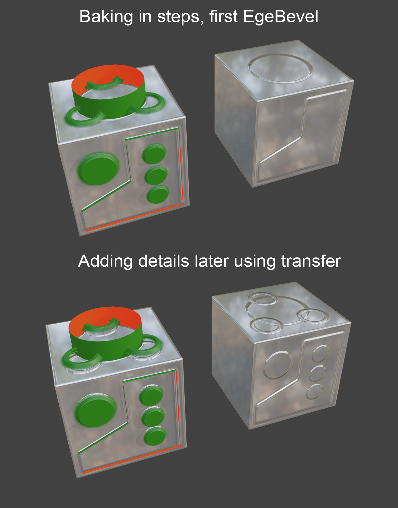

# Other Features

For the purpose of demonstration I will be using just a simple geometry.

### Normals Transfer vs Normals EdgeBevel + Transfer



<figure><figcaption>
Bake types differences
</figcaption></figure>

<figure><figcaption>
Normals Transfer settings used
</figcaption></figure> <figure><figcaption>
EdgeBevel settings used
</figcaption></figure>




You may use both **Normals Transfer** and **Normals EdgeBevel** with **Transfer** enabled to transfer details from any geometry. It is very useful when used on floating geometry.

* Objects on the left are baked using ordinary **Normals Transfer**
* Objects on the right are baked using **Normals Edgebevel + Transfer**
* Both green circles are using vertex colors with alpha transparency
* Both hexagonal cylinders have hard edges
* Notice that you may use **EdgeBevel + Transfer** to capture even details that are perfectly parallel to the target surface




### Vertex color alpha mask



<figure><figcaption>
Usage of vertex color mask
</figcaption></figure>

<figure><figcaption>
Layering effect
</figcaption></figure>



Top object didn't use the **Use Vertex Color Mask** feature, bottom one did.

You may see the difference in the blending.

This example was done using Normals Transfer, but it also works when using EdgeBevel with enabled Transfer.

Also notice that you may use this feature to layer details on top of each other. Just bake the details in sequence.



### Adding details when baking using EdgeBevel



<figure><figcaption>
EdgeBevel geometry details
</figcaption></figure>

<figure><figcaption>
Settings used for this example
</figcaption></figure>



The EdgeBevel feature may be used to add all sorts of additional details when baking.

You may add holes, or protrusions by using geometry with removed UVs (this makes sure that the object itself is not baked in the texture, but it is used to modify the resulting normals)

* RED faces are back facing faces
* GREEN are forward facing faces


This example does NOT use the Transfer feature. It bakes all that is selected and has UVs in the main 0..1 UV square.





### Baking in steps



<figure><figcaption></figcaption></figure>



There is no need to bake everyhing in a single step.

It's possible to keep on adding details after initial bake was done.

In this example I first baked EdgeBevel and then transfered details on top of it.


