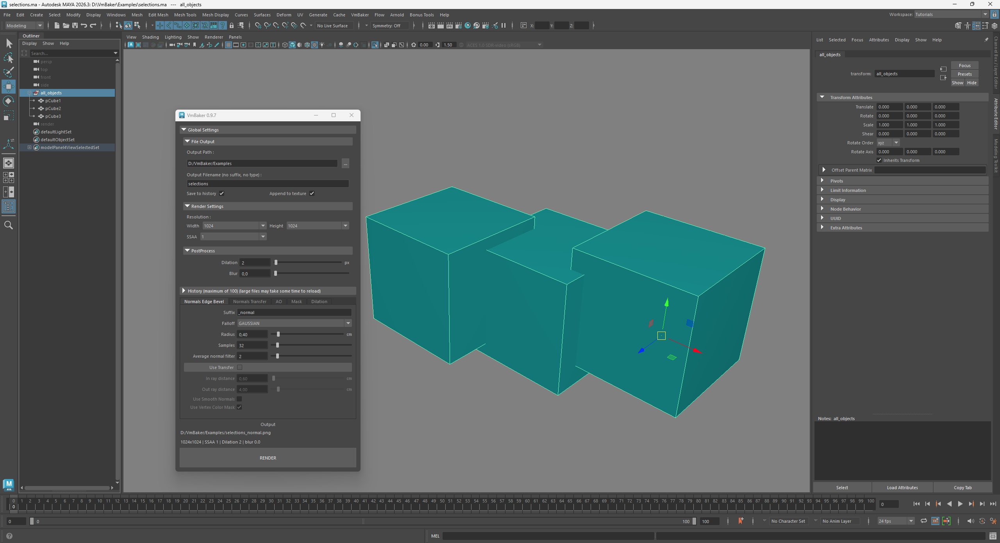
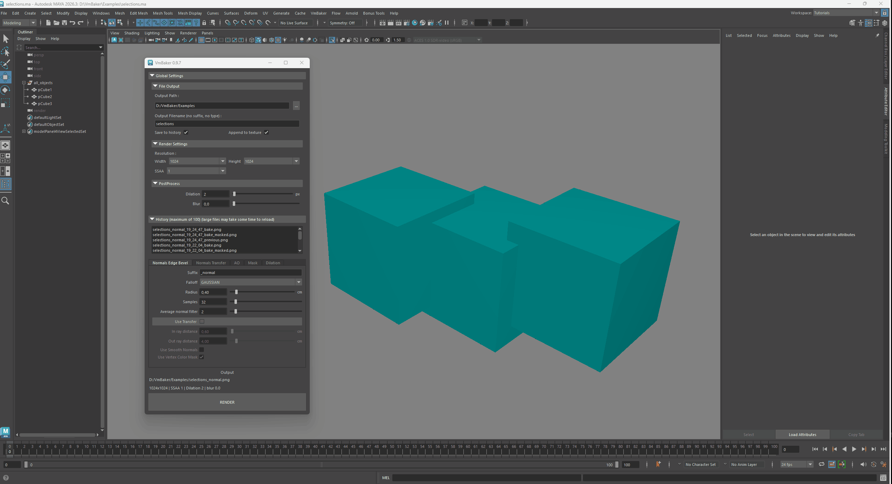
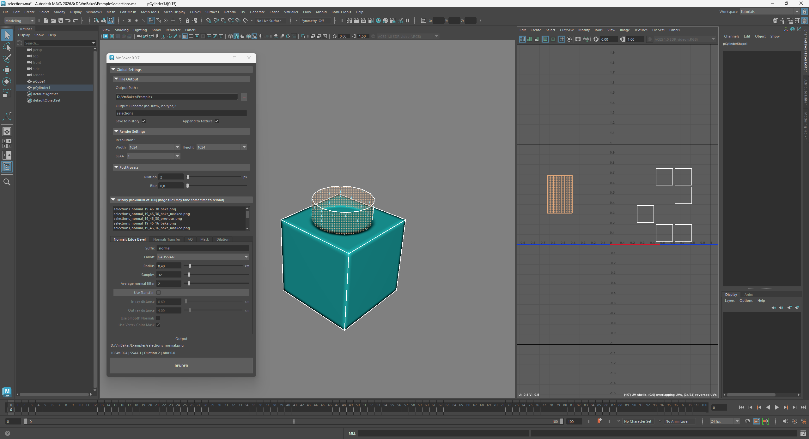
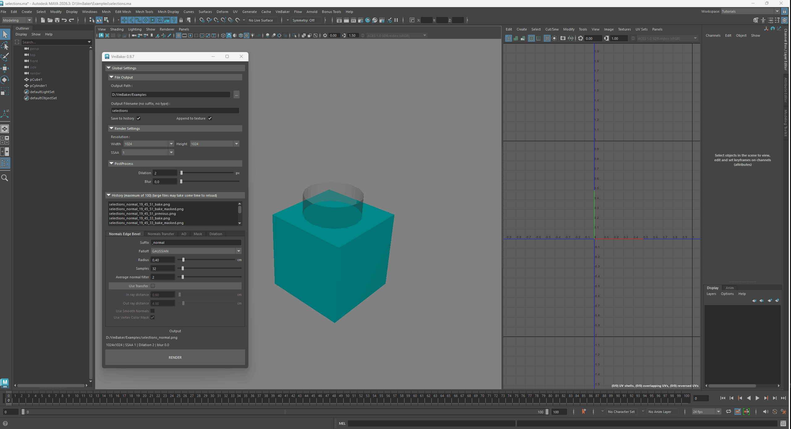
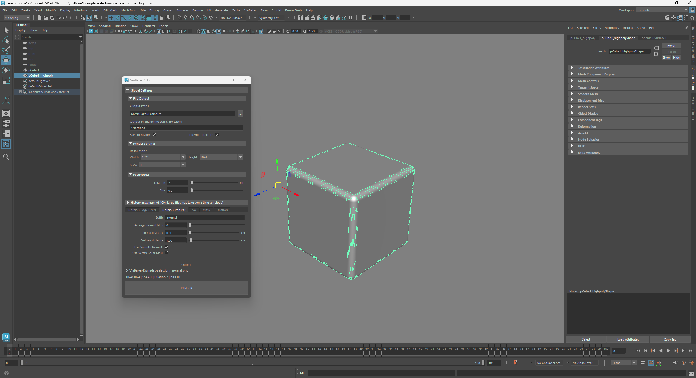
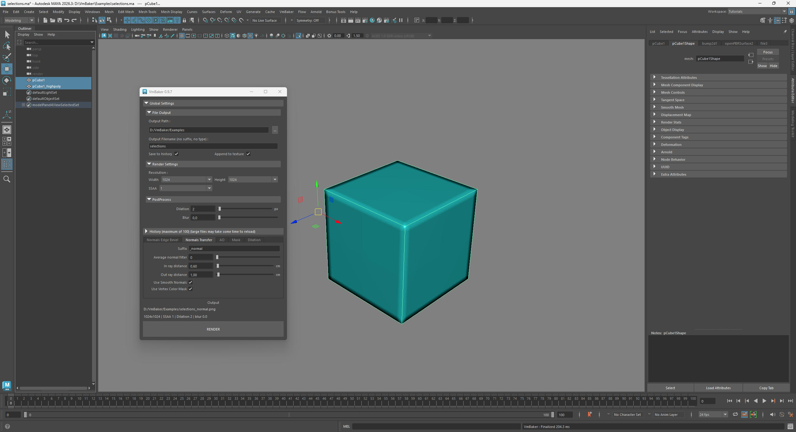
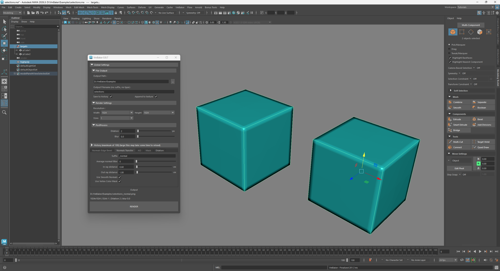
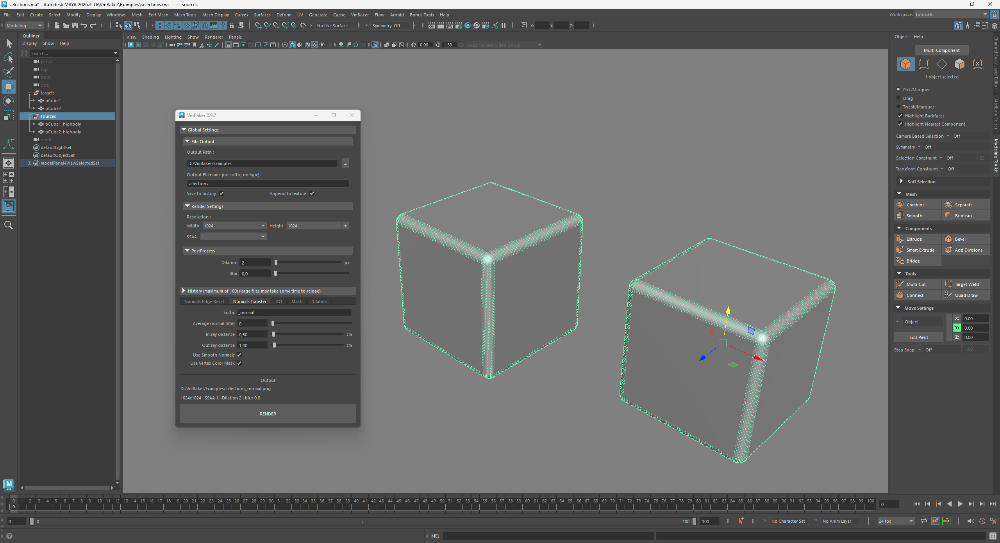
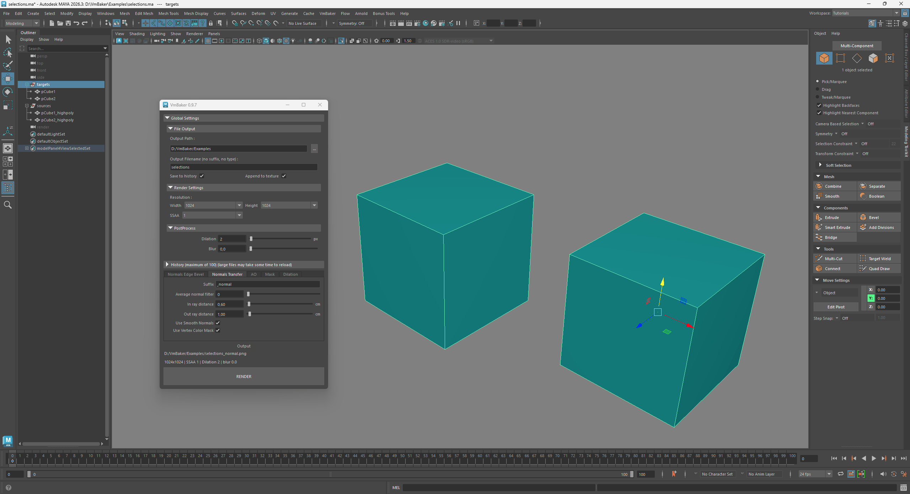

# Selections + visibility + UVs

The logic behind selections and visibility and how the affect the baking process is quite simple.

The rules are :

* hidden object does not participate in the bake
  * this means, if you don't want object to affect the bake at all - hide it
* currently baking only UV square of 0-1
  * everything outside of that range is not baked, but will participate in bake
  * used for creating bevels, holes etc. when using EdgeBevel
* when **using Transfer** - target is always selected as last
* when **not using** **Transfer** - order of selection does not matter
* all children in hierarchy of the selected objects are considered selected
  * this means that you may setup target and source "bake groups" instead of selecting individual objects

Which creates few scenarios that I will cover bellow. I will cover them all for completeness, but after a few you will get the idea :)

## Baking without using transfer




<figure><figcaption>
multiple objects without using transfer
</figcaption></figure> <figure><figcaption>
selections workflow
</figcaption></figure>




I will demonstrate it on an edge bevel, but the logic applies to all baking without using Transfer.

In the GIF animation I try to demonstrate what selection affect.

1. I show baking of the whole "all\_objects" group
   1. you may also notice that I use history to go back in the bake process
2. Then I show that selecting objects individually is also possible
3. Lastly I show that hiding the object inside the group makes the object "invisible" for the bake




## Baking using helper objects (without UVs / outside 0-1)




<figure><figcaption>
helper object with UVs outside the main 0-1 UV square
</figcaption></figure> <figure><figcaption>
baking using helper objects
</figcaption></figure>




In this example I bake the same cube again but this time I add a detail using a helper mesh object that has it's UVs outside the 0-1 uv range. Removing the UVs works the same way.



## Transfer single highpoly onto single lowpoly




<figure><figcaption>
single lowpoly
</figcaption></figure> <figure><figcaption>
single highpoly
</figcaption></figure> <figure><figcaption>
single highpoly transfered onto single lowpoly
</figcaption></figure>




1. select highpoly
2. select lowpoly and bake



## Transfer single highpoly object onto multiple lowpoly objects




<figure><figcaption>
single highpoly
</figcaption></figure> <figure><figcaption>
multiple lowpoly
</figcaption></figure> <figure><figcaption>
single highpoly transfered onto multiple lowpoly objects
</figcaption></figure>




1. select highpoly
2. select the parent group of the lowpoly objects and bake



## Transfer multiple highpoly objects onto multiple lowpoly objects




<figure><figcaption>
multiple highpoly
</figcaption></figure> <figure><figcaption>
multiple lowpoly
</figcaption></figure> <figure><figcaption>
multipe highpoly transfered onto multiple lowpoly objects
</figcaption></figure>




1. select either all highpoly objects individually or select the parent group of highpoly objects
2. select the parent group of the lowpoly objects and bake



