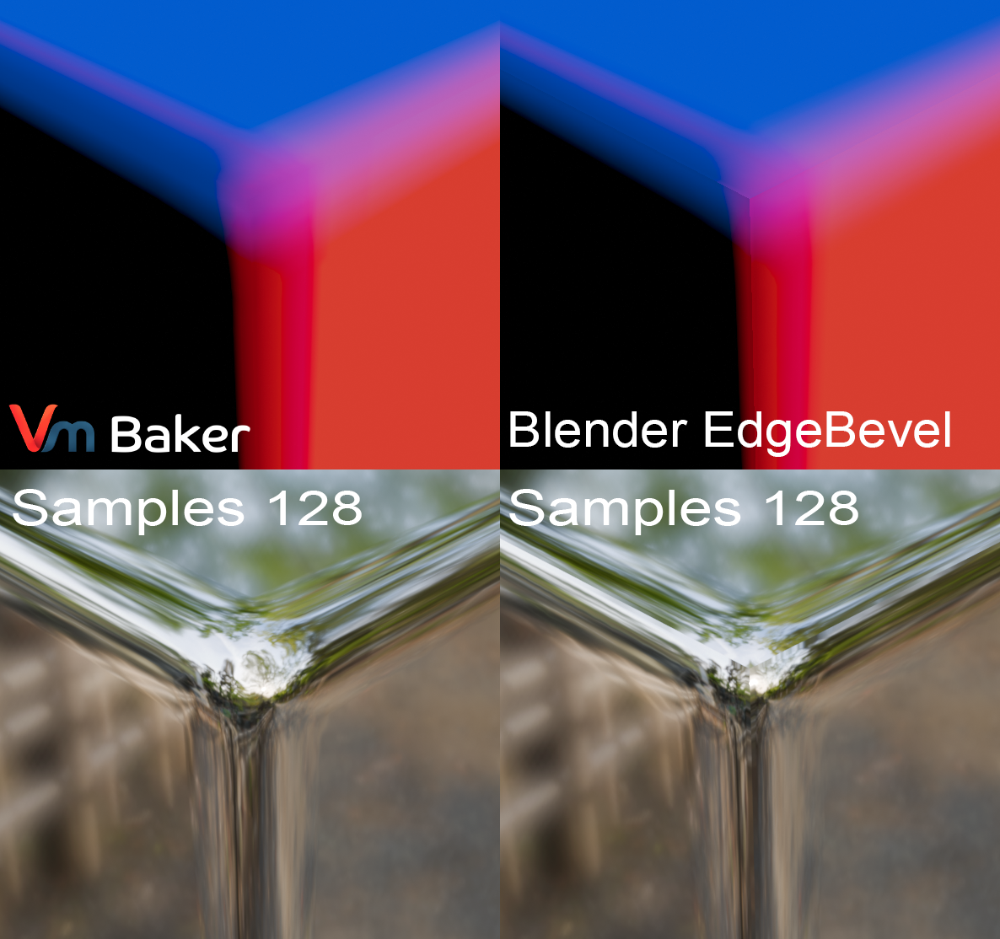
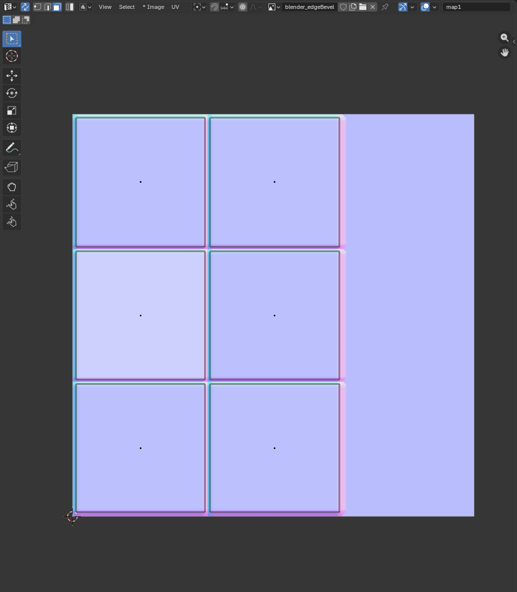
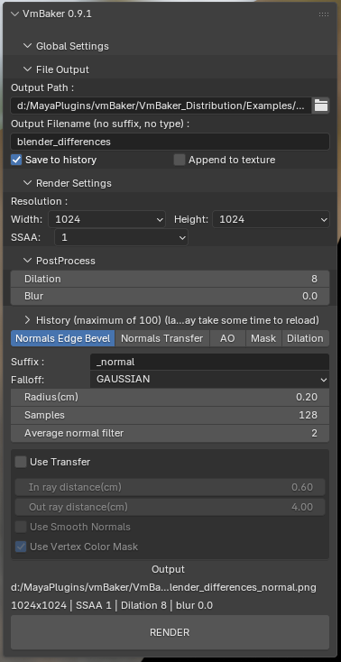
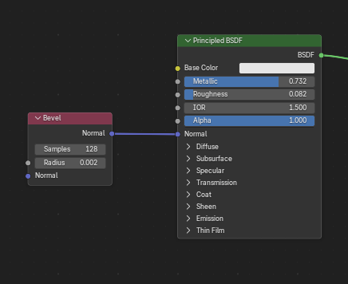
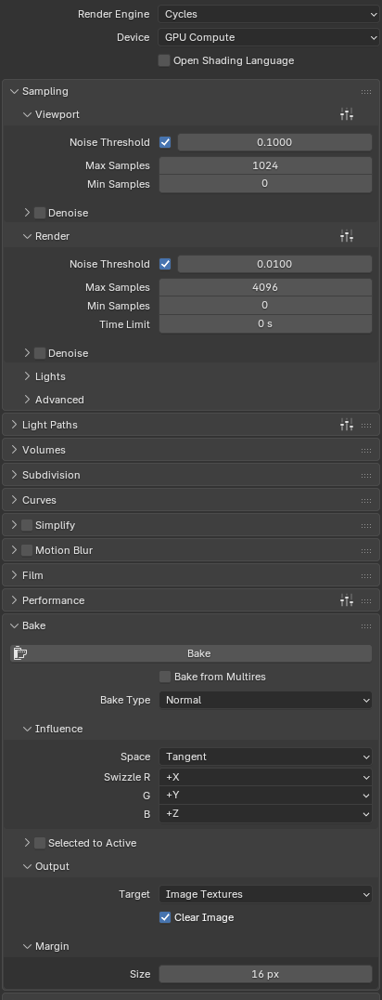
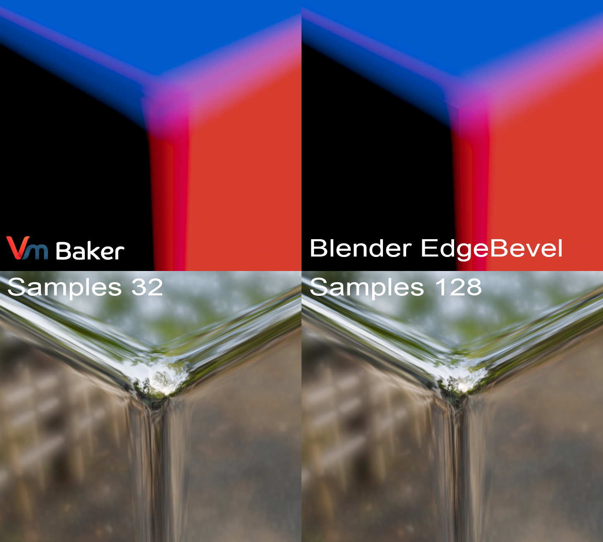

# VmBaker vs Blender

## Precision in general

The simplest demonstration I can show you the difference in precision is how blender handles baking normal maps when using edge beveling. Let's demonstrate it on a simple cube as it is the most obvious example.

### The differences

<figure><figcaption>
VmBaker vs Blender at the same sample count
</figcaption></figure>

* Notice the disconnection with the native Blender on the corner and the edge of the cube and the well connected VmBaker baked normals

### The setup

<figure><figcaption>
Cube edge bake example
</figcaption></figure> <figure><figcaption>
UVs
</figcaption></figure>

There is nothing special about the setup really, it is just a single cube with size of 5x5x5cm and UVs unpacked for baking normalmaps - UVs split on hard edges.

### Bake settings



<figure><figcaption></figcaption></figure>

Simple setup using VmBaker with radius of 2mm and 128 samples for comparable results.




<figure><figcaption></figcaption></figure> <figure><figcaption></figcaption></figure>

Simple setup using Bevel node in shader editor with 128 samples, radius of 2mm and using Cycles with GPU support for the bake.



## Precision vs samples

<figure><figcaption>
VmBaker vs Blender EdgeBevel
</figcaption></figure>

* Notice that the VmBaker still holds well even with a lot less samples (this results with faster baking speeds)

### Separated objects

<figure><figcaption>
Baking separate objects
</figcaption></figure>

* With VmBaker may render as many objects as you like, you do not have to merge the objects as you do with native Blender baking. Still notice the disconnected edges on the native Blender bake.
