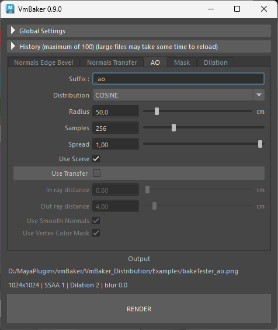

# Ambient Occlusion (AO)

Ambient Occlusion calculates soft geometric self-shadowing by determining how exposed each point in a scene is to ambient lighting. It is commonly used to darken crevices, corners, and tight spaces.

You may use this mode to bake on the selected model itself, or use transfer to bake AO from high-poly source meshes.

## General Settings

* **Suffix:** The filename suffix appended to the output file (default is `_ao`).
* **Distribution:** The sample pattern used to cast rays.
  * _Cosine:_ Biases samples heavily toward the perpendicular normal angle.
  * _Uniform:_ Fires rays evenly across the entire hemisphere.
* **Radius:** The maximum distance rays will travel. Any geometry beyond this distance is ignored and will not occlude the surface.
* **Samples:** The number of rays cast per texel. Higher sample counts are necessary for AO to reduce noise.
* **Spread:** Constrains the angle of the sample hemisphere. Lower values focus rays strictly toward the surface normal, while `1.0` fires across the full 180 degrees.
* **Use Scene:** When enabled, VmBaker will evaluate all other (unselected) objects in the scene as potential occluders against your selected target.
  * It uses all visible meshes

## Use Transfer

Toggle this section to enable projection baking, which evaluates the ambient occlusion of a high-poly source mesh and bakes it onto your low-poly target.

* **In ray distance:** The distance rays are cast _inward_ from the target surface to find the source mesh.
* **Out ray distance:** The distance rays are cast _outward_ from the target surface to map geometry that protrudes past the low-poly shell.
*   **Use Smooth Normals:** Calculates the initial ray direction using interpolated vertex normals instead of flat face normals.

    > \[!NOTE] The smooth normals approach requires supporting edges on the geometry. Disabling this may result in disconnections on hard, un-beveled edges.
* **Use Vertex Color Mask:** When used, vertex color alpha channel on the source geometry controls the opacity of the bake.
  * May be used to overlay details on top of existing bakes using transparency
