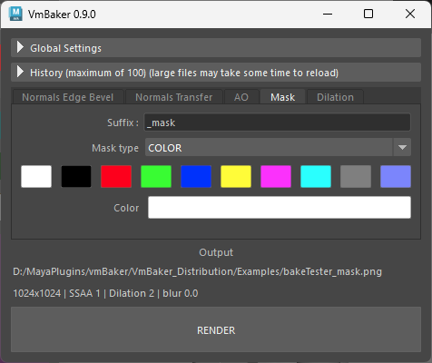

# Mask

The Mask mode is a utility used to generate colored maps based on the picked color or vertex colors of the mesh. You may think of it as an ID map.

## Settings

* **Suffix:** The filename suffix appended to the output file (default is `_mask`).
* **Mask type:** Select the type of data to bake. "Color" mode will fill the entire UV shell with a completely flat color.
  * _Color:_ Uses simple color picked in the UI.
  * _Vertex Color:_ Uses vertex colors that is applied on the mesh.
* **Color:** The target color picker used for the mask fill. This is only applicable when "Color" is selected as the Mask type.
* **Swatches:** Quick access buttons to set the Mask Color to exact, pre-defined values (e.g., pure black, pure white, pure red).

