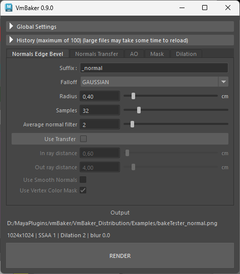
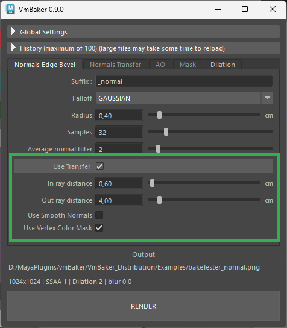

# Normals Edge Bevel

This baking mode generates a normal map that simulates smoothed, rounded edges on hard-surface geometry without adding extra polygons to the mesh.

## General Settings

* **Suffix:** The filename suffix appended to the output file (default is `_normal`).
* **Falloff:** Controls the type of the falloff used for easing the radius.
  * Gaussian
  * Linear
* **Radius:** The maximum distance from each surface point that samples are gathered within. This dictates how "wide" the bevel effect appears.
  * Units are in centimeters.
* **Samples:** The number of rays cast per texel. Higher sample counts will significantly reduce noise, but will increase the bake time.
  * Default 32 samples work for most situations
* **Average normal filter:** This filters out small nuances back to the default flat normal color (RGB `128, 128, 255`) to avoid unwanted gradients or noise in the bakes.

## Use Transfer

Toggle this section to enable projection baking, which transfers details from a high-poly source mesh onto your low-poly target.

* **In ray distance:** The distance rays are cast _inward_ from the target surface to find the source mesh.
* **Out ray distance:** The distance rays are cast _outward_ from the target surface to map geometry that protrudes past the low-poly shell.
*   **Use Smooth Normals:** Calculates the initial ray direction using interpolated vertex normals instead of flat face normals.

    > \[!NOTE] The smooth normals approach requires supporting edges on the geometry. Disabling this may result in disconnections on hard, un-beveled edges.
* **Use Vertex Color Mask:** When used, vertex color alpha channel on the source geometry controls the opacity of the bake.
  * May be used to overlay details on top of existing bakes using transparency

