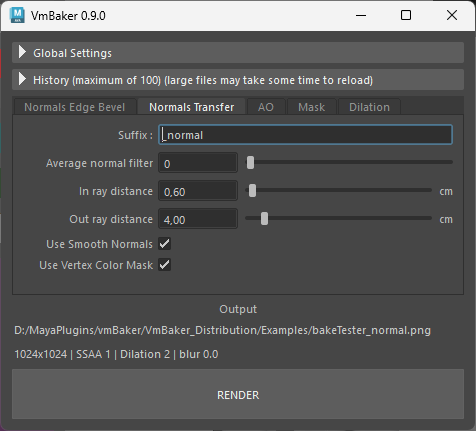

# Normals Transfer

Unlike the Edge Bevel tab, the **Normals Transfer** mode is strictly dedicated to standard projection baking. It captures the surface details of a complex high-poly source mesh and bakes them into a tangent-space normal map for a low-poly target.

The key difference from **Normals Edge Bevel** mode is that it uses just minimum samples making it much faster. On the other hand, you loose the benefit of beveling / smoothing the baked normals.

## General Settings

* **Suffix:** The filename suffix appended to the output file (default is `_normal`).
* **Average normal filter:** Blends the baked normals with their neighbors to smooth out high-frequency details, pushing minor deviations back towards flat normal blue (RGB `128, 128, 255`).
* **In ray distance:** The distance rays are cast _inward_ from the target surface to find the source mesh.
* **Out ray distance:** The distance rays are cast _outward_ from the target surface to map geometry that protrudes past the low-poly shell.
*   **Use Smooth Normals:** Calculates the initial ray direction using interpolated vertex normals instead of flat face normals.

    > \[!NOTE] The smooth normals approach requires supporting edges on the geometry. Disabling this may result in disconnections on hard, un-beveled edges.
* **Use Vertex Color Mask:** When used, vertex color alpha channel on the source geometry controls the opacity of the bake.
  * May be used to overlay details on top of existing bakes using transparency

