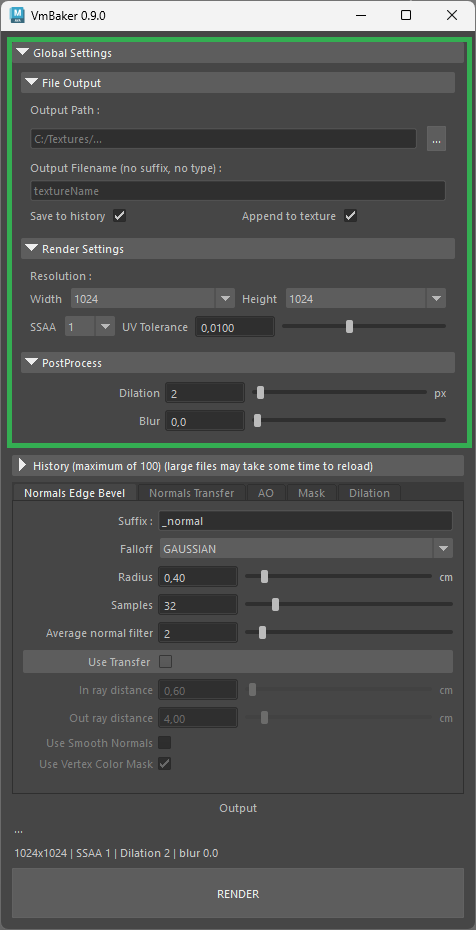

# Global Settings

These settings are applied globally, regardless of which baking mode you currently have selected.


There may be some settings that override some global settings in the respective bake modes.


<figure><figcaption>
Screenshot of Global settings
</figcaption></figure>

