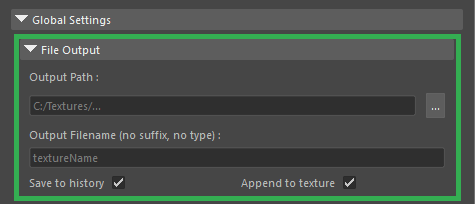

# File Output

Configure where and how your baked textures are saved.

* **Output Path:** The base folder where textures are saved.
* **Output Filename:** The core name of the file without suffix or extension. VmBaker manages the file format (e.g., `.png`) and mode-specific suffixes (e.g., `_normal`) automatically.
* **Save to history:** When enabled, VmBaker saves each bake result to a numbered history folder based on the texture name, preventing accidental data loss.
* **Append to texture:** Instead of overwriting the entire image, this overlays the newly baked UV islands on top of the existing texture.

