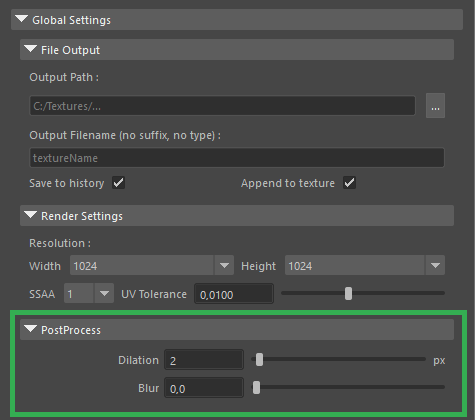

# PostProcess

Effects applied after the initial render is complete.

* **Dilation:** Expands the texture edges into empty UV space. This is crucial for preventing background pixels from bleeding into your texture when the model is viewed from a distance (mip-mapping).
* **Blur:** Applies a Gaussian blur to the final baked texture, softening the overall result.

