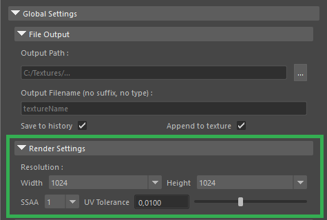

# Render Settings

Control the quality and size of your final baked maps.

* **Resolution (Width / Height):** The output texture width and height in pixels.
* **SSAA:** Supersampling factor. Renders the map at a higher internal resolution and downscales it to reduce aliasing (jagged edges). _Note: Higher values will increase render times._
* **UV Tolerance:** The distance threshold for UV seam detection.
  * Increasing this value helps greatly with UV border edges that are at an angle, effectively mitigating UV seams.
  * Increasing it too much may introduce some artifacts.
  * Decrease this value if you see strange artifacts or if the UV padding behaves unpredictably.
  * The default value works for the majority of scenarios.

