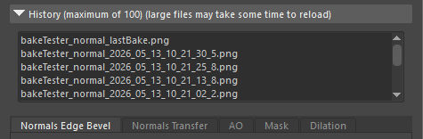
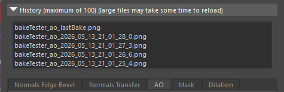

# History

The History panel provides a quick way to view and revert to previous bakes without having to manually search through your operating system's file browser.

* **History List:** A list displaying your previously baked textures.
  * Each "suffix" has it's own history list, so for example textures with "\_normal" suffix have the same list of history, "\_ao" have it's own list and so on.
  * By changing the suffix you will also change the list of the textures listed in the history
* **Reloading:** Selecting an item from this list will restore the texture.

> \[!WARNING] The history list has a maximum capacity of 100 items. Reloading large files may take some time depending on your disk speed.

 <figure><figcaption>
Screenshot of AO History list
</figcaption></figure>

