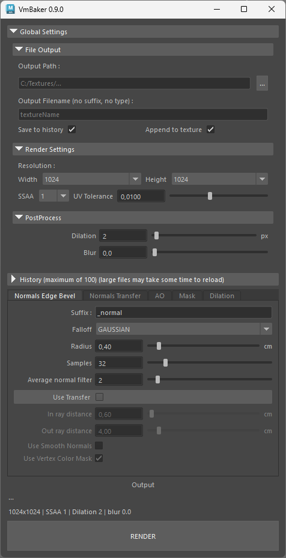
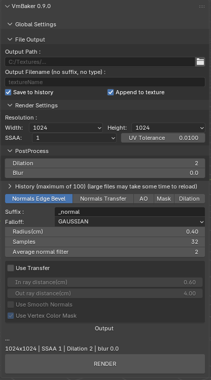

# Introduction

## Interface Breakdown

The interface is divided into three main sections:

1. **Global Settings:** Controls for output directories, rendering resolution, and post-processing effects.
2. **History:** A quick-access panel to load your previous bakes.
3. **Baking Modes (Tabs):** The core rendering modes, each with its own specific settings and transfer options.
4. **Output:** Preview of the render settings and the Render button

Use the sidebar navigation to explore the specific settings for each tab and feature in the documentation.


The UI in all the different DCC applications should look and work in a similar manner, here is just an example of the UI for both Maya and Blender. All other documentation will show just one of the UI, but the logic applies to the whole UI for all DCC applications.


<figure><figcaption></figcaption></figure> <figure><figcaption></figcaption></figure>

